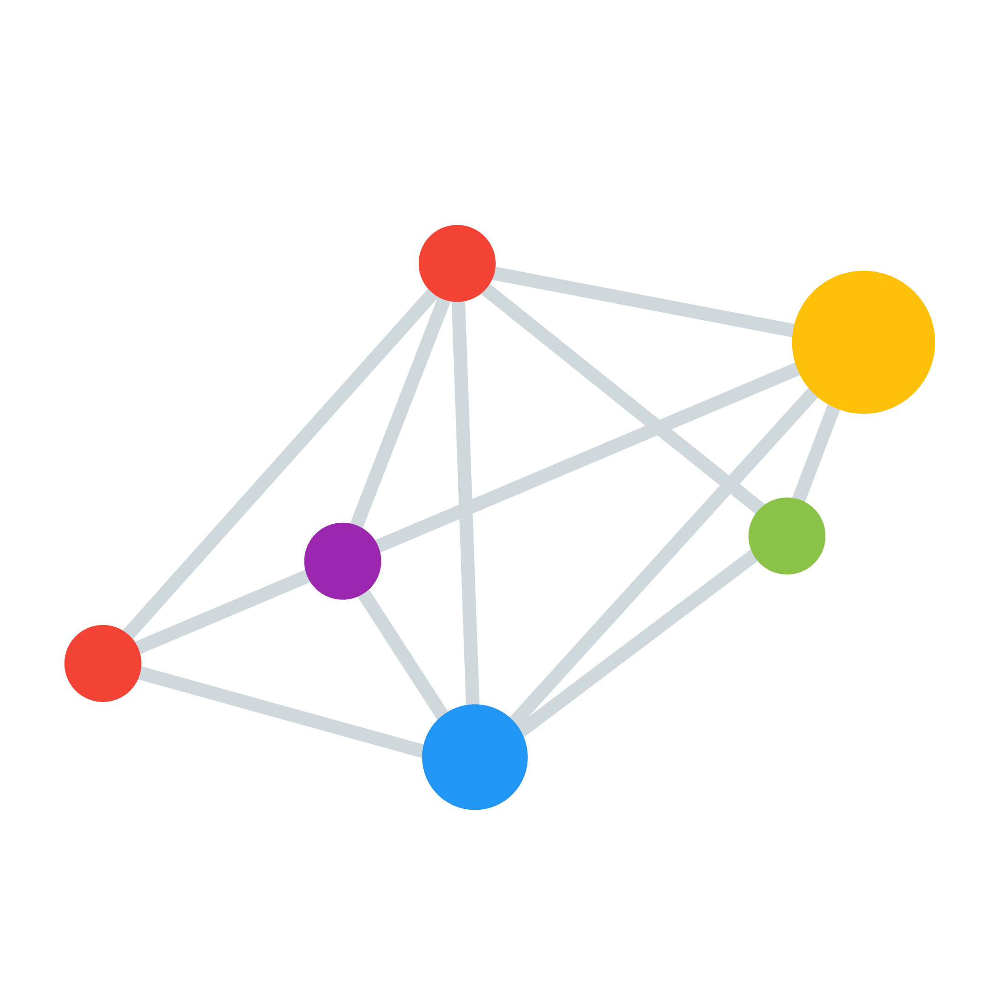
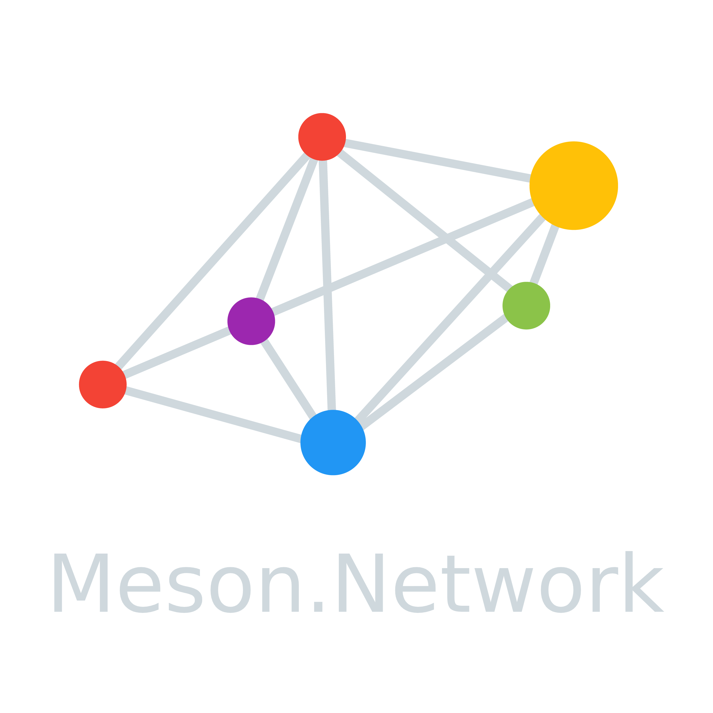
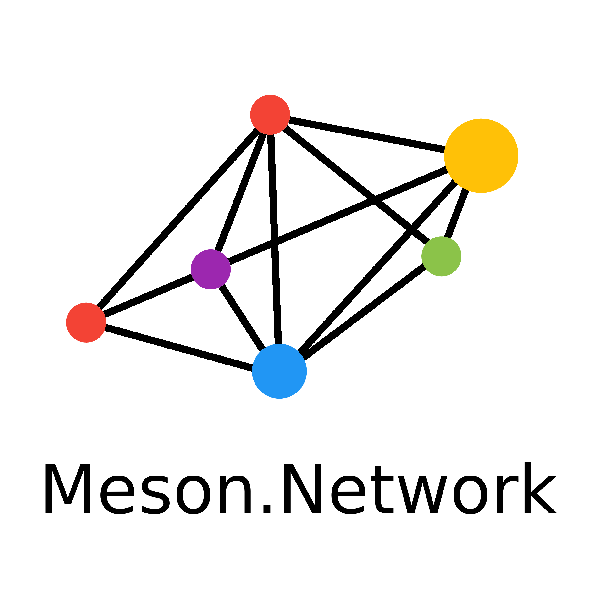
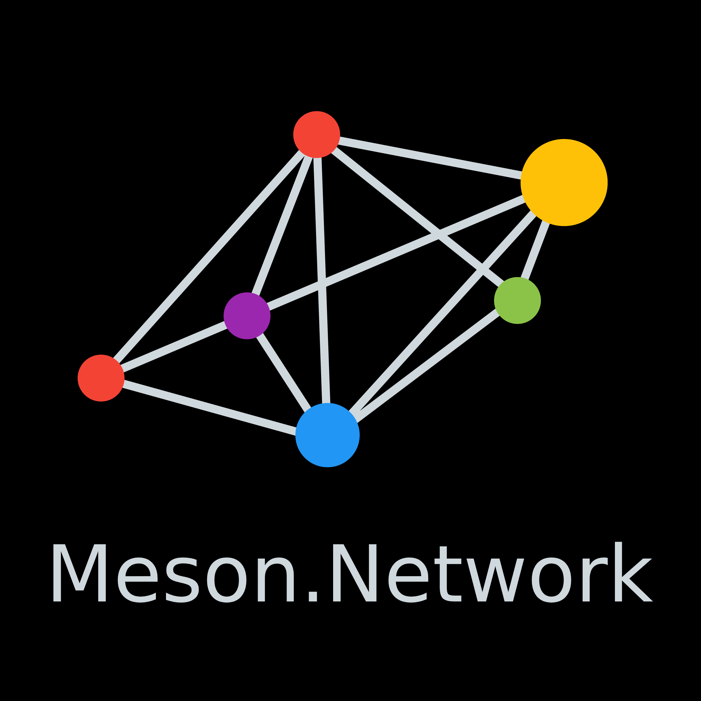

# Meson Network Media Kit and Brand Resources

Get the official Meson Network brand resources and learn about the usage guidelines.

## Meson Network Logo

<table>
  <tbody>
    <tr>
      <th colspan="2">Transparent Background</th>
    </tr>
    <tr>
    <td></td>
    <td ></td>
    </tr>
    <tr>
      <td></td>
      <td></td>
    </tr>
    <tr>
      <th colspan="2">Black & White Background</th>
    </tr>
    <tr>
    <td></td>
    <td></td>
    </tr>
  </tbody>
</table>

## Brand Assets

[📂 Download](https://github.com/daqnext/brand-kit/releases/download/1.0/meson-media-kit-1.0.zip)