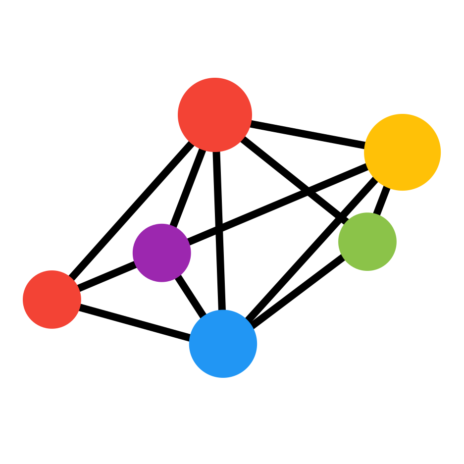

# Meson Network Media Kit and Brand Resources

Get the official Meson Network brand resources and learn about the usage guidelines.

Take care of below points while using the logo:

- Do not crop the logo, rotate it, or place it with other colors
- Do not re-create using any other typeface
- Do not use shadows, transparency, or any other effects
- Refrain from altering the shape, proportion of the logos
- Keep padding around the logo

## Meson Network Logo

<table>
  <tbody>
    <tr>
      <th colspan="2">Meson Network</th>
    </tr>
    <tr>
    <td></td>
    <td ></td>
    <td ></td>
    <td ></td>
    </tr>
    <tr>
      <th colspan="2">Token $MESON</th>
    </tr>
    <tr>
    <td></td>
    <td></td>
    <td ></td>
      <td></td>
    </tr>
    <tr>
      <th colspan="2">Meson Favicon</th>
    </tr>
    <tr>
    <td></td>
    <td></td>
    <td ></td>
    <td ></td>
    </tr>
    <tr>
      <th colspan="2">Meson Avatar</th>
    </tr>
    <tr>
    <td></td>
    <td></td>
    <td ></td>
      <td></td>
    </tr>
  </tbody>
</table>

## Brand Assets

[📂 Download](https://github.com/daqnext/brand-kit/releases/download/1.5/meson-media-kit-1.5.1.zip)

[🤖 Figma](https://www.figma.com/file/GRn2fxGrsJS1ggaus4T3Rv?embed_host=notion&kind=&node-id=5%3A180&viewer=1)

[🌀 Notion](https://mesonnetwork.notion.site/Meson-Network-Brand-Resources-309319eabba64e9f8e18c22b558afd87)